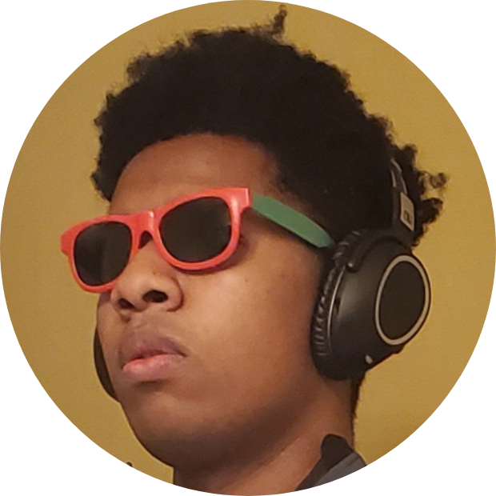

<!DOCTYPE html>

<html>

<head>
    <meta charset="utf-8">
    <meta name="viewport" content="width=device-width, initial-scale=1, shrink-to-fit=no">
    <link rel="stylesheet" href="https://fonts.googleapis.com/css?family=Roboto:300,400,500,700|Material+Icons">
    <link rel="stylesheet" href="https://unpkg.com/bootstrap-material-design@4.1.1/dist/css/bootstrap-material-design.min.css" integrity="sha384-wXznGJNEXNG1NFsbm0ugrLFMQPWswR3lds2VeinahP8N0zJw9VWSopbjv2x7WCvX" crossorigin="anonymous">
    <link rel="stylesheet" href="styles/bootstrap-material-design.min.css">
    <link rel="stylesheet" href="styles/main.css">
    <title>Michael Webb's Portfolio</title>
</head>

<body>

    

        

            

            

                

                  About Me
                

                

                

                  <blockquote class="blockquote mb-0">
                    
My name is Michael Webb and I have a lot of interests: programming, cars, video games, coffee, table tennis, music, etc etc.
                        It may be a lot, but it sure does keep me busy. I consider myself and extrovert that also enjoys alone time, or maybe I'm
                        just indecesive. Nonetheless I hope you enjoy my Resume !
                    

                  </blockquote>
                
                

                    

                        <button id = "githubBtn" class = "tOButton">Github</button>
                        <button id = "linkedInBtn" class = "tOButton">LinkedIn</button>
                        <button id = "emailBtn" class = "tOButton">Email</button>
                        <button id = "resumeBtn" class = "tOButton">Resume <i class="material-icons">double_arrow</i> </button>
                    

                

                

              

        

        <video autoplay muted loop id="backgroundVideo">
            <source src="videos/Background_08.mp4" type = "video/mp4">
        </video>

    

</body>

</html>
